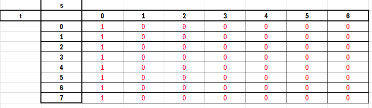
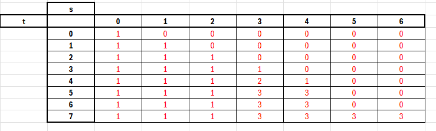

# subsequencesbd

Prueba de código AppGate distinct subsequences

La prueba está diseñada para que el sistema identifique la cantidad se subsecuencias que existe en una secuencia enviada.

Los atributos iniciales son:

Atributo base representado con la letra "s", el cual contendrá la cadena de texto donde se va a realizar la búsqueda de la subsequencia.

Atributo a buscar representado con la letra "t", el cual contendrá la cadena de texto que se va a validar que exista en el atributo "s".

A continuación se da una explicación del funcionamiento de la solución propuesta.

String "s": "rabbbit" -> tamaño = 7, String "t": "rabbit" -> tamaño = 6

Estado inicial de la matriz a partir de los tamaños de los atributos de entrada, la idea es que en la matriz se lleve un contador de las subsecuencias encontradas

La primera iteración corresponde a:
i = 1 (s[0] = 'r'):

Inicia recorriendo la variable "t" letra por letra y compara contra la primera letra de "s"

j = 1 (t[0] = 'r'): s[0] == t[0] es verdadero. matriz[1][1] = matriz[0][0] + matriz[0][1] = 1 + 0 = 1. 

j = 2 (t[1] = 'a'): s[0] != t[1]. matriz[1][2] = matriz[0][2] = 0.

j = 3 (t[2] = 'b'): s[0] != t[2]. matriz[1][3] = matriz[0][3] = 0.

j = 4 (t[3] = 'b'): s[0] != t[3]. matriz[1][4] = matriz[0][4] = 0.

j = 5 (t[4] = 'i'): s[0] != t[4]. matriz[1][5] = matriz[0][5] = 0.

j = 6 (t[5] = 't'): s[0] != t[5]. matriz[1][6] = matriz[0][6] = 0.

Continua con la siguiente línea de la matriz

La segunda iteración corresponde a:
i = 2 (s[1] = 'a'):

j = 1 (t[0] = 'r'): s[1] != t[0]. matriz[2][1] = matriz[1][1] = 1.

j = 2 (t[1] = 'a'): s[1] == t[1]. matriz[2][2] = matriz[1][1] + matriz[1][2] = 1 + 0 = 1.

se recorren los for hasta completar la matriz

se continúan las iteraciones hasta i = 7 que es el tamaño del atributo "s"

El resultado luego de recorrer los dos for es el siguiente

Cuando termina de procesar los dos atributos y de identificar las cantidades de subsecuencias, el valor final queda en la última posición de la matriz, que es la que se retorna.

La aplicación esta creada en spring boot versión 2.6.3, usando la versión de Java 11, se utiliza MAVEN en su versión 3.x.x.
El desarrollo se realizo con la ayuda del IDE Intellij IDE versión 2024.3.4.
Un ejemplo de la forma de usar el servicio es el siguiente:

http://localhost:8080/subsequences/algoritmo/rabbbit/rabbit

http://localhost:8080/subsequences/ -> corresponde al nombre del servicio rest
http://localhost:8080/subsequences/algoritmo/ -> corresponde al nombre de la operación rest encargado de ejecutar la subsecuencia
http://localhost:8080/subsequences/algoritmo/rabbbit/ -> corresponde al valor definido en el ejercicio como "s" que es la cadena de texto en la cual se va a realizar la búsqueda de la subsecuencia.
http://localhost:8080/subsequences/algoritmo/rabbbit/rabbit -> corresponde al valor definido en el ejercicio como "t" que es la cadena de texto que se quiere búscar en el atributo "s"
